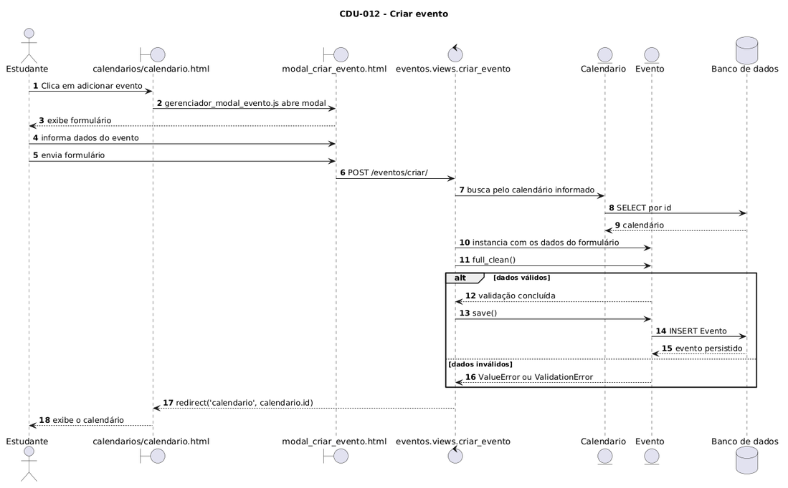
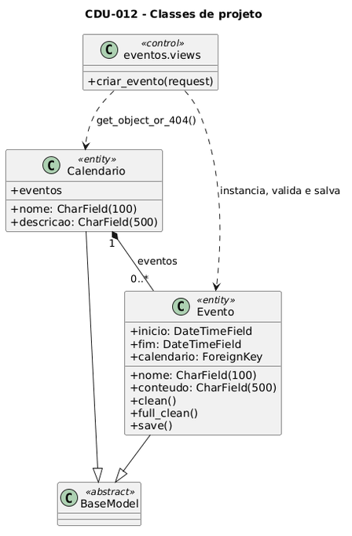

# CDU-012 Criar evento

- **Ator principal**: Estudante
- **Atores secundários**: Nenhum
- **Descrição**: O estudante cria um evento em um calendário.
- **Pré-condição**: O estudante está autenticado no sistema e é administrador do calendário associado ao evento.
- **Pós-Condição**: O evento está registrado no sistema.

## Fluxo Principal

|                            Ações do ator                            |                   Ações do sistema                   |
| :--------------------------------------------------------------------: | :-----------------------------------------------------: |
|             1 - Estudante acessa a opção "Criar evento".             | 2 - Sistema exibe o formulário de criação de evento. |
| 3 - Estudante preenche título, calendário, data, e descrição. Estudante também informa horário inicial e horário final ou se é um evento que ocupa o dia todo. | |
|                   4 - Estudante envia o formulário.                   |         5 - Sistema valida os dados informados.         |
|                                                                        | 6 - Sistema salva o evento e exibe mensagem de sucesso. |

## Fluxo Alternativo I - Dados inválidos

|                              Ações do ator                              |                                  Ações do sistema                                  |
| :-----------------------------------------------------------------------: | :----------------------------------------------------------------------------------: |
| 1.1 - Estudante envia o formulário com campos inválidos ou incompletos. | 1.2 - Sistema exibe mensagem de erro indicando quais campos precisam ser corrigidos. |

> Obs. as seções a seguir apenas serão utilizadas na segunda unidade do PDSWeb (segundo orientações do gerente do projeto).
>

## Diagrama de Interação (Sequência ou Comunicação)

## Diagrama de Classes de Projeto

