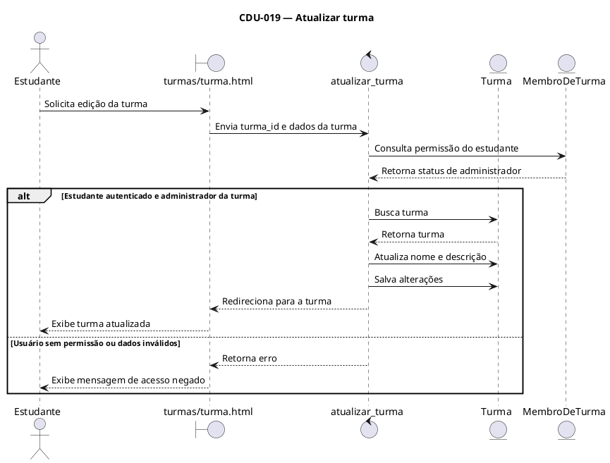
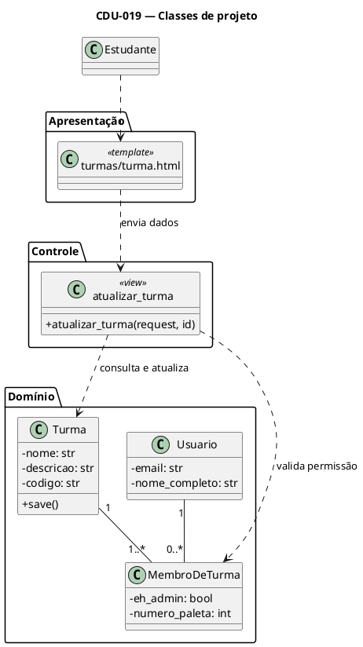

# Diagramas de projeto — CDU-019

## Diagrama de sequência

```plantuml
@startuml cdu_019_atualizar_turma_sequencia
title CDU-019 — Atualizar turma

actor Estudante
boundary "turmas/turma.html" as TelaTurma
control "atualizar_turma" as AtualizarTurma
entity "Turma" as Turma
entity "MembroDeTurma" as MembroDeTurma

Estudante -> TelaTurma: Solicita edição da turma
TelaTurma -> AtualizarTurma: Envia turma_id e dados da turma
AtualizarTurma -> MembroDeTurma: Consulta permissão do estudante
MembroDeTurma --> AtualizarTurma: Retorna status de administrador

alt Estudante autenticado e administrador da turma
    AtualizarTurma -> Turma: Busca turma
    Turma --> AtualizarTurma: Retorna turma
    AtualizarTurma -> Turma: Atualiza nome e descrição
    AtualizarTurma -> Turma: Salva alterações
    AtualizarTurma --> TelaTurma: Redireciona para a turma
    TelaTurma --> Estudante: Exibe turma atualizada
else Usuário sem permissão ou dados inválidos
    AtualizarTurma --> TelaTurma: Retorna erro
    TelaTurma --> Estudante: Exibe mensagem de acesso negado
end

@enduml
```

## Diagrama de classes de projeto

```plantuml
@startuml cdu_019_atualizar_turma_classes
title CDU-019 — Classes de projeto

skinparam classAttributeIconSize 0

package "Apresentação" {
    class "turmas/turma.html" as TelaTurma <<template>>
}

package "Controle" {
    class atualizar_turma <<view>> {
        +atualizar_turma(request, id)
    }
}

package "Domínio" {
    class Usuario {
        -email: str
        -nome_completo: str
    }

    class Turma {
        -nome: str
        -descricao: str
        -codigo: str
        +save()
    }

    class MembroDeTurma {
        -eh_admin: bool
        -numero_paleta: int
    }
}

Usuario "1" -- "0..*" MembroDeTurma
Turma "1" -- "1..*" MembroDeTurma

Estudante ..> TelaTurma
TelaTurma ..> atualizar_turma : envia dados
atualizar_turma ..> MembroDeTurma : valida permissão
atualizar_turma ..> Turma : consulta e atualiza

@enduml
```
