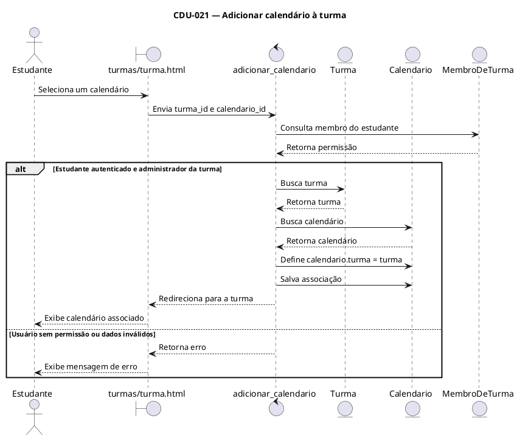
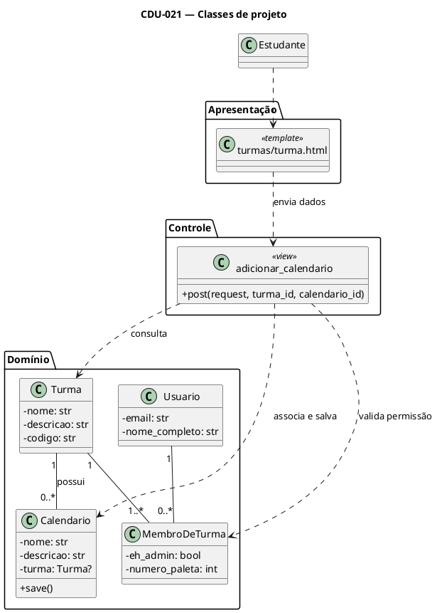

# Diagramas de projeto — CDU-021

## Diagrama de sequência

```plantuml
@startuml cdu_021_adicionar_calendario_sequencia
title CDU-021 — Adicionar calendário à turma

actor Estudante
boundary "turmas/turma.html" as TelaTurma
control "adicionar_calendario" as AdicionarCalendario
entity "Turma" as Turma
entity "Calendario" as Calendario
entity "MembroDeTurma" as MembroDeTurma

Estudante -> TelaTurma: Seleciona um calendário
TelaTurma -> AdicionarCalendario: Envia turma_id e calendario_id
AdicionarCalendario -> MembroDeTurma: Consulta membro do estudante
MembroDeTurma --> AdicionarCalendario: Retorna permissão

alt Estudante autenticado e administrador da turma
    AdicionarCalendario -> Turma: Busca turma
    Turma --> AdicionarCalendario: Retorna turma
    AdicionarCalendario -> Calendario: Busca calendário
    Calendario --> AdicionarCalendario: Retorna calendário
    AdicionarCalendario -> Calendario: Define calendario.turma = turma
    AdicionarCalendario -> Calendario: Salva associação
    AdicionarCalendario --> TelaTurma: Redireciona para a turma
    TelaTurma --> Estudante: Exibe calendário associado
else Usuário sem permissão ou dados inválidos
    AdicionarCalendario --> TelaTurma: Retorna erro
    TelaTurma --> Estudante: Exibe mensagem de erro
end

@enduml
```

## Diagrama de classes de projeto

```plantuml
@startuml cdu_021_adicionar_calendario_classes
title CDU-021 — Classes de projeto

skinparam classAttributeIconSize 0

package "Apresentação" {
    class "turmas/turma.html" as TelaTurma <<template>>
}

package "Controle" {
    class adicionar_calendario <<view>> {
        +post(request, turma_id, calendario_id)
    }
}

package "Domínio" {
    class Usuario {
        -email: str
        -nome_completo: str
    }

    class Turma {
        -nome: str
        -descricao: str
        -codigo: str
    }

    class Calendario {
        -nome: str
        -descricao: str
        -turma: Turma?
        +save()
    }

    class MembroDeTurma {
        -eh_admin: bool
        -numero_paleta: int
    }
}

Usuario "1" -- "0..*" MembroDeTurma
Turma "1" -- "1..*" MembroDeTurma
Turma "1" -- "0..*" Calendario : possui

Estudante ..> TelaTurma
TelaTurma ..> adicionar_calendario : envia dados
adicionar_calendario ..> MembroDeTurma : valida permissão
adicionar_calendario ..> Turma : consulta
adicionar_calendario ..> Calendario : associa e salva

@enduml
```