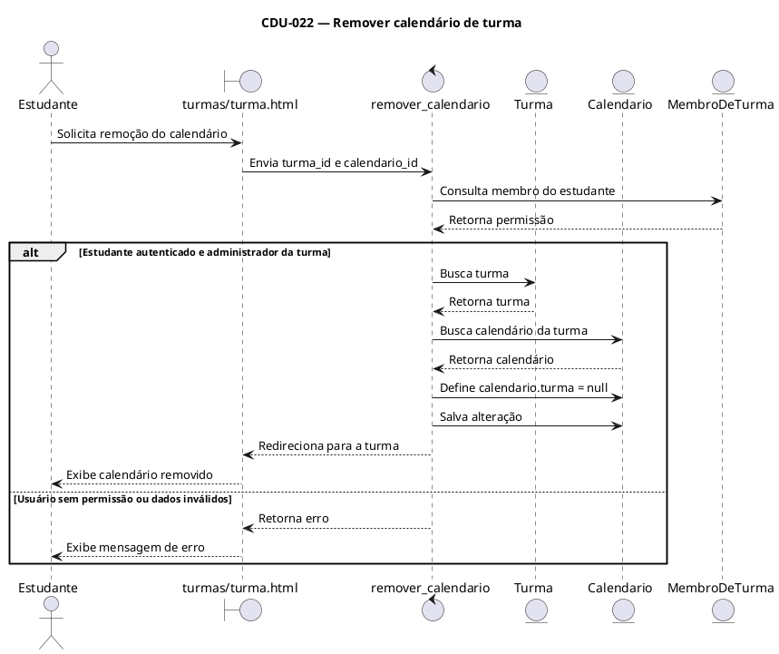
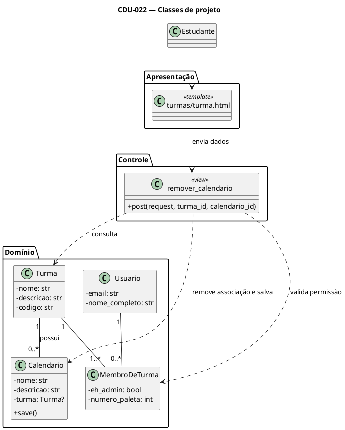

# Diagramas de projeto — CDU-022

## Diagrama de sequência

```plantuml
@startuml cdu_022_remover_calendario_sequencia
title CDU-022 — Remover calendário de turma

actor Estudante
boundary "turmas/turma.html" as TelaTurma
control "remover_calendario" as RemoverCalendario
entity "Turma" as Turma
entity "Calendario" as Calendario
entity "MembroDeTurma" as MembroDeTurma

Estudante -> TelaTurma: Solicita remoção do calendário
TelaTurma -> RemoverCalendario: Envia turma_id e calendario_id
RemoverCalendario -> MembroDeTurma: Consulta membro do estudante
MembroDeTurma --> RemoverCalendario: Retorna permissão

alt Estudante autenticado e administrador da turma
    RemoverCalendario -> Turma: Busca turma
    Turma --> RemoverCalendario: Retorna turma
    RemoverCalendario -> Calendario: Busca calendário da turma
    Calendario --> RemoverCalendario: Retorna calendário
    RemoverCalendario -> Calendario: Define calendario.turma = null
    RemoverCalendario -> Calendario: Salva alteração
    RemoverCalendario --> TelaTurma: Redireciona para a turma
    TelaTurma --> Estudante: Exibe calendário removido
else Usuário sem permissão ou dados inválidos
    RemoverCalendario --> TelaTurma: Retorna erro
    TelaTurma --> Estudante: Exibe mensagem de erro
end

@enduml
```

## Diagrama de classes de projeto

```plantuml

@startuml cdu_022_remover_calendario_classes
title CDU-022 — Classes de projeto

skinparam classAttributeIconSize 0

package "Apresentação" {
    class "turmas/turma.html" as TelaTurma <<template>>
}

package "Controle" {
    class remover_calendario <<view>> {
        +post(request, turma_id, calendario_id)
    }
}

package "Domínio" {
    class Usuario {
        -email: str
        -nome_completo: str
    }

    class Turma {
        -nome: str
        -descricao: str
        -codigo: str
    }

    class Calendario {
        -nome: str
        -descricao: str
        -turma: Turma?
        +save()
    }

    class MembroDeTurma {
        -eh_admin: bool
        -numero_paleta: int
    }
}

Usuario "1" -- "0..*" MembroDeTurma
Turma "1" -- "1..*" MembroDeTurma
Turma "1" -- "0..*" Calendario : possui

Estudante ..> TelaTurma
TelaTurma ..> remover_calendario : envia dados
remover_calendario ..> MembroDeTurma : valida permissão
remover_calendario ..> Turma : consulta
remover_calendario ..> Calendario : remove associação e salva

@enduml
```
